# Meal Management Application

## Description
This application is designed for students who use meal services in a restaurant. It provides an intuitive interface for managing **students, their meals, and payments** efficiently.

## Features
- **Student Data Management** – Displays student information such as name, surname, number of meals, and last payment date.
- **Add/Edit Student Records** – Allows adding new students or modifying existing details.
- **Card Number Scanning** – Enables scanning a student’s card number, displaying their details, and deducting meals from their account.

## Technologies Used
- **C#** – Primary programming language for application development.
- **SQLite** – Database system used for storing student and meal records.

## Screenshots

### **Login Screen**
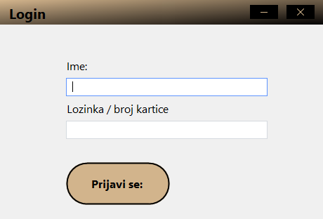

### **Starting Page (Admin)**
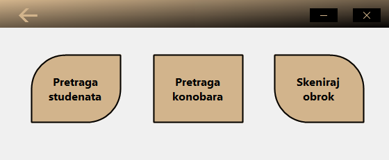

### **Starting Page (Waiter)**
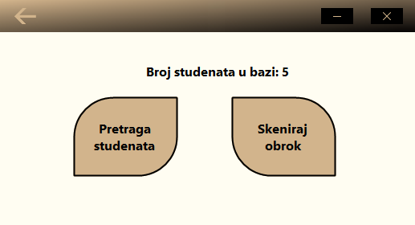

### **Student Search**
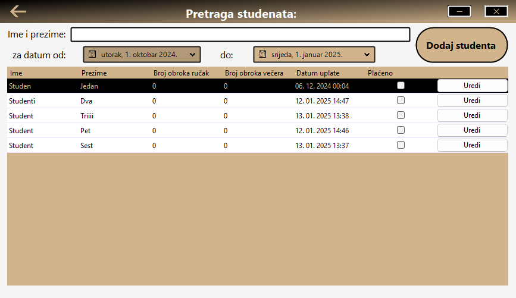

### **Adding a Student**
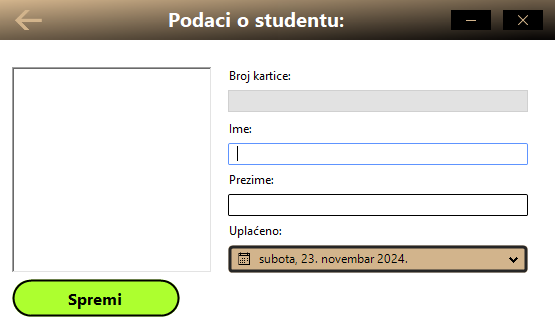

### **Editing Student Information**
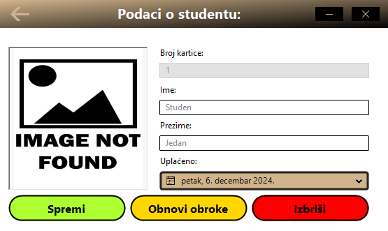

### **Waiter Search**
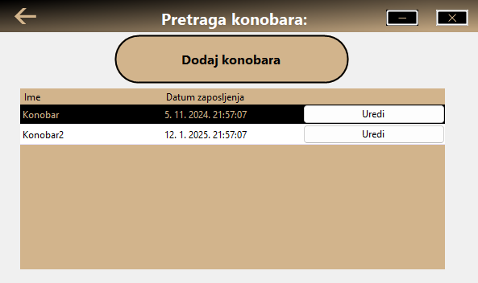

### **Editing Waiter Information**
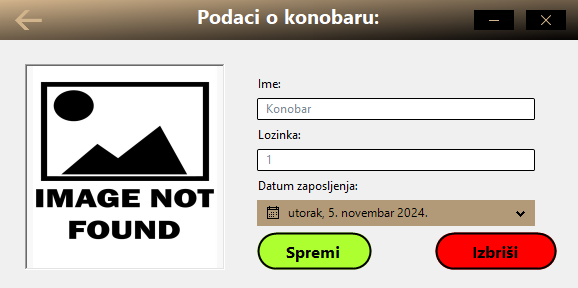

### **Adding a Waiter**
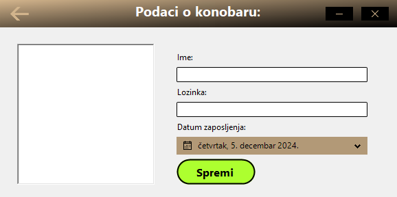

### **Scanning Student Card**
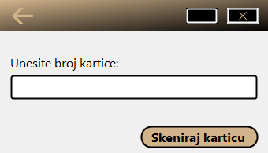

### **Scanned Student Data**
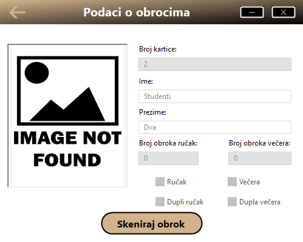

### **Student Data Overview**
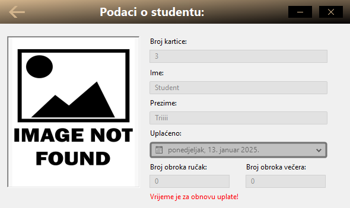

## How to Run the Application

1. **Clone the Repository**:
   ```bash
   git clone https://github.com/MerzukSisic/Student-AO-Obroci.git

2. Open the Project in Visual Studio.
3. Install Required Packages (if necessary).
4. Run the Application